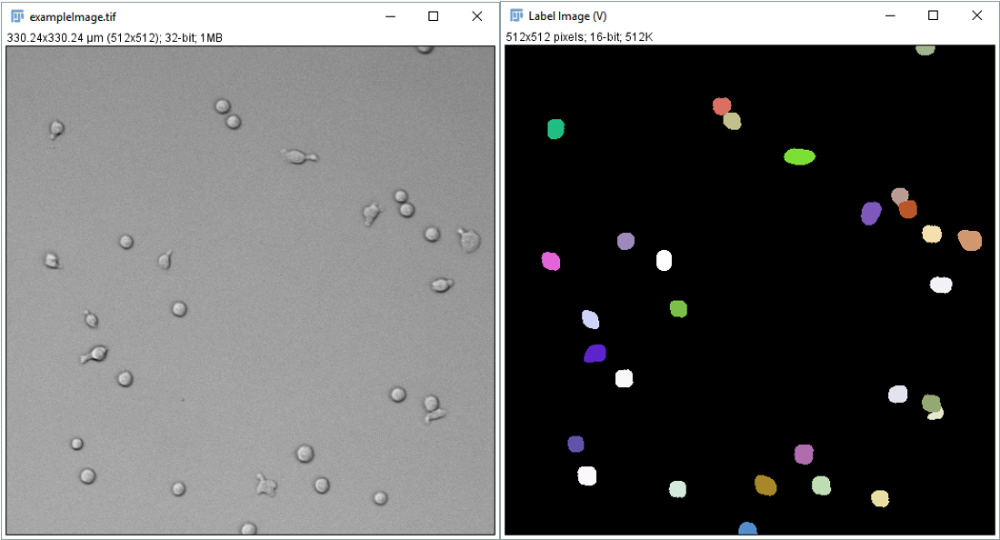

---
title: Exercises from An Introduction to Image Analysis in Microscopy with ImageJ/FIJI
toc: true
include-before: |
 \begin{center}\date{\today}\end{center}
---

\pagebreak
\newpage

# Part 1
## Using OMERO
[//]: # (Ex1.1)
Let us start by uploading an image file (e.g. sted-confocal.lif from the sciebo folder) into the Omero database:

1. Start the Omero.insight software. Open the config window by clicking the little wrench and enter the server address omero-1.cecad.uni-koeln.de. Enter your credentials and connect to Omero.

2. Unfold the Display Groups dropdown menu in the toolbar and tick the All Members checkbox in the course group.

3. Start the importer (toolbar icon with blue arrow and colorful circles). Select the file sted-confocal.lif from your local harddrive for upload. Create your own project and dataset, start the import and close the importer when done.

4. Update the projects view (icon on top of the Project pane) and find your uploaded file. Explore the metadata (acquisition pane, on the right, check if you can download your original data again and leave a comment and a rating to at least one of the images.

5. Close the insight client, start the webclient (i.e.  open https://omero.cecad.uni-koeln.de in your favorite webbrowser), find your image and compare the handling of insight and webclient.

6. Now try to load the image from Omero in Fiji. If the required plugin is already installed, you will find the entry OMERO in the Plugins Menu.Select Connect to OMERO. Login again and choose your image in the Omero window.

**Tags:** exercise omero-1

\pagebreak
\newpage
## Omero.figure - Image with scalebar
[//]: # (Ex1.2)
1.  Login into Omero.web. Find the image sted-confocal.lif \[Fab
    Antikoerper\] in the projects pane and right-click on the entry in
    the Project Explorer file list.

2.  In the context menu, select \[Open with \> Omero.figure\]

3.  A new figure window with the selected image opens up. First of all,
    press the **Save** button.

4.  To make sure our image is the active element in the figure, click on
    the image. Then have a look at the Info tab of the tool panel.
    Adjust the width and height until the image has a resolution of
    about 300 dpi.

5.  Now select the Preview tab. Change the color of the LUT and adjust
    the brightness as you like.

6.  Now, select the Labels tab. Add a scalebar (**Show** button)
    activate the scalebar label and adjust position, size and color of
    the scalebar as you like.

7.  Add some text to the figure legend. Try the suggested Markdown
    syntax if you like.

8.  **Save** the figure again. **Export** to pdf, Tiff (300dpi), and new
    Omero Image.

9.  Note that the exported figures were added as attachement to the
    original image.

**Tags:** exercise omero-figure-1

## Omero.figure - Creating multipanel figures
[//]: # (Ex1.3)
1.  Add another page to the figure \[File \> Paper Setup\... \> Number
    of Pages\]

2.  Select the new page. Now we would like to add the image
    sted-confocal.lif \[Overlay001\]. So change back to the project
    explorer and select the image (Left-click). In the top left corner
    of the General tab, click the Link button (chain symbol) and copy
    the link from the popup. Switch back to the Figure-tab and click the
    **Add Image** button in the menu bar. Paste the link into the
    textbox and click **Add Image**.

3.  Move the image to the second page of the figure. In the Info tab
    click on the chain symbol to lock the aspect ratio of the image,
    then change the width to 150. Click the **Set dpi** button and enter
    a value of 600 dpi.

4.  Switch to the Preview tab. Change LUT of the second channel to red
    and adjust the brightness of the individual channels.

5.  Switch to the Labels tab. Press the **Edit** button. Draw a small
    square shaped ROI (press shift while drawing) in an interesting
    region of the image. Set the line thickness to 10, choose a color.

6.  Press the **Show** button in the Scalebar section. Adjust size and
    color switch on the label.

7.  Write 'Merged' in the textbox in the Add Labels section. Change the
    font size to 18 and make sure position is set to Top. Click **Add**.
    Now replace 'Merged' in the textbox by 'Overview', switch Position
    to Left Vertical and click **Add** again.

8.  Copy and paste the image five times. Arrange them into two row of
    three images. After roughly moving the images in place, select them
    all and use the **Align to Grid** button in the menu bar for quick
    alignment.

9.  Select the second image in the first row. Switch to the Preview tab
    and switch off the second channel. Now switch to the Labels tab.
    Delete the Overview label. Change the 'Merged' label to 'Confocal'.

10. Select the third image in the first row. Switch to the Preview tab
    and switch off the first channel. Now switch to the Labels tab.
    Delete the Overview label. Change the 'Merged' label to 'STED'.

11. Select the first image in the second row. In the Labels tab delete
    the Merged label and change the 'Overview' label to 'Magnified ROI'.

12. Switch to the Preview tab. Press the **Crop** button. Select the ROI
    from figure and click **OK**. Confirm the deletion of the ROI in the
    cropped image. In the Labels tab adjust the scalebar size if
    necessary.

13. In the further images switch off one channel as in the first row,
    delete all labels, crop and adjust scalebars in the same way.

14. Save the figure.

**Tags:** exercise omero-figure-2

## Omero.figure - Limitations
[//]: # (Ex1.4)
1. Please try to create figures in OMERO.figure similar to the figures created in the exercises "Manipulating Stacks - Creating a montage" and "Manipulating Stacks – Creating an Insert" in FIJI.

2. Review the exercises on creating a calibration bar making z-projections and think whether it would be (easily) possible to implement them in OMERO.figure as well.

**Tags:** exercise omero-figure-3

\pagebreak
\newpage

# Part 2
## Using Bioformats
[//]: # (Ex2.1)
Let's import a microscope specific file format into
Fiji.

1.  Open the image sted-confocal.lif with
    `[Plugins > Bio-Formats > Bio-Formats Importer]`.

2.  In the next dialog, you can select various import options. Make sure that you load
    the data into a Hyperstack and tick the Display metadata option.

    {#fig:adj-bri width="63%"}

3.  The next window allows you to select a series. Several microscope
    image formats are actually libraries of files. In this case, you
    should see three different files. Open one of the series.

4.  Two windows are opened. One showing the image, the other showing the
    metadata information. Scroll through the information and find the
    Dimension Length, Number of Elements and Unit. Use these values to
    calculate the pixel size.

**Tags:** exercise bioformats-1
\pagebreak
\newpage

## Scale Bars

[//]: # (Ex2.2)

Let's explore one thing you usually have to include in your
microscopy data: a scale bar that indicates the size of each pixel.

1.  Open the image sted-confocal.lif in FIJI from OMERO
    `[Plugins > OMERO > Connect to OMERO]`.

2.  We now want to add a scale bar to our image. In this case, Fiji
    already knows the pixel size - let us check whether our previous
    calculations were correct. Go to `[Analyze > Set Scale...]`. This
    dialog should show you how many pixels are in one micrometer.

3.  In case you have an image where information about the scale is
    visible in the image itself (e.g. an object of known size), you can then measure the length with the
    line tool and enter this information in the dialog. Clicking on Global
    helps if you take one image of a micro-scale and want to use this
    information in other images you took with the same settings (e.g. on
    a small Lab-Microscope). To try this activate the global option and open another image of your choice. Can you imagine potential problems caused by the Global option?

4.  Let's add a scale bar now. Use `[Analyze > Tools > Scale Bar]`.
    Similar to the calibration bar, the dialog lets you adjust various
    visual parameters.

5.  In FIJI you can immediately recognize whether an image contains scaling information. Take a look at the subtitle line of an image window! The default way to access this scaling information is via the image properties dialog (press ``Ctrl+Shift+P`` to open). 

6. Also look for the scaling information in Omero.web (General pane). Do you observe a difference when opening images with and without scaling information in the Omero.iviewer (regarding the scalebar)? Can you add scaling information to images in Omero?

**Tags:** exercise scalebar-1

\pagebreak
\newpage

## Brightness Adjustments
[//]: # (Ex2.3)
1.  Open the file fibroblast_sim.tif from OMERO in Fiji. This is a 16-bit
    gray-scale image showing actin filaments in a cell.

2.  You should note that the image looks rather dark. Fortunately, Fiji
    has a way to adjust the brightness and contrast of an image without
    altering the original data. Go to `[Image > Adjust > Brightness/Contrast...]`, you should see a dialog as shown in the figure.

 {#fig:adj-bri width="23%"}
    
3.  Click on `[Auto]`. The image gets brighter as the maximum brightness
    is now associated with a lower image intensity. This linear scale
    can be adjusted manually by changing the slider positions. `[Reset]`
    reverts to the original intensity scaling.

4.  Play with the sliders to set the image intensity scaling.

5.  Using `[Set]`, we can either enter precise minimum and maximum
    values or show a defined range (8-,10-,12-,15-,16-bit) and also
    propagate our selection to all other open images. Again, the
    original pixel values remain, we only change the display.

**Tags:** exercise brightness-1

\pagebreak
\newpage

## Contrast Enhancement and Image Manipulation 
[//]: # (Ex2.4)
Let's assume you want to show gel data in your manuscript. After performing following steps, can
you discuss why contrast enhancement might be considered fraud?

1.  Open the image gel.tif and duplicate the image (another
    Fiji sample image).

2.  Adjust Contrast and Brightness and compare images. What is the
    problem with the contrast-enhanced image?

{#fig:contrast-problem width="65%"}   

[//]: # (discussion whats the problem? - overestimation of bands)
[//]: # (how to find out if image HAS been preprocessed? - clipped histogram)
**Tags:** exercise brightness-2

\pagebreak
\newpage

## Working with histograms
[//]: # (Ex2.5)
1.  Open the image hela-cells.tif. This is another
    standard Fiji sample image showing HeLa cells, so you can open it via `[File > Open Samples > HeLa Cells 48bit RGB]`. If you open the file from OMERO set Color Mode to Composite in the Bioformats Import Options dialog. Lysosomes should be red,
    mitochondria green and the nucleus blue.

2. An easy way to learn something about the intensities in the image is to move the cursor over the image and observe the intensity values in status bar of the FIJI main window (Press Enter to bring the main window to front, in case it is covered by ohter windows.). Another handy tool is the Pixel Inspector which you can activate via a toolbar icon (magnifier glass with Px). When the Pixel Inspector is active you can left-click into the image and another window entitled "Pixel Values" will open which shows the pixel values within the little red square you placed by clicking.

3.  Histograms are a means to quickly get an impression of the complete intensity distribution in an image. We can show the histogram with `[Analyze > Histogram]` (Shortcut: ``Ctrl+H``). If FIJI asks whether all three channels should be diplayed, answer No. The
    histogram is then displayed in a new window. The x-axis shows the pixel value and
    the y-axis the count. Also note that the histogram refers to the channel
    that was active when the command was called. For images of bitdepth above 8bit by default the histogram is binned to 256 bins in total. If you prefer to adjust the beginning yourself, open the histogram window via the shortcut ``Ctrl+Alt+H`` and set the minimum and maximum X values as well as the number of bins as you like (try e.g. 0-65535 and 65536 bins for a 16bit image).

{#fig:histog width="25%"}   

4.  Obtain the highest and lowest intensities from the histogram. What
    does the histogram range tell you?
    
5.  Click on \[list\] to obtain a list with values and counts. \[Log\]
    displays the same histogram on a log-scale.

6.  Click on \[live\] in the histogram dialog and change the channel.
    Observe the changes in the histogram and note the color changes in
    the depicted colormap bar.

**Tags:** exercise histogram-1 

\pagebreak
\newpage

## Histogram Normalization
[//]: # (2.6)
1.  Open the image hela-cells.tif and duplicate the green
    channel. Obtain a histogram.

2.  Use `[Process > Enhance Contrast]` on the duplicate. Set saturated
    pixels to 0, tick normalize and not equalize and obtain a histogram
    afterwards.

{#fig:enhance-contrast-dialog width="35%"}   

3.  Compare the histograms.

4.  Leave the images open; you can also explore different settings.

**Tags:** exercise histogram-2

\pagebreak
\newpage

## Bit-Depth Conversion
[//]: # (Ex2.7)
1.  Open the image beads.tif from OMERO.
    Duplicate the image with `[Image > Duplicate...]`. Choose the line
    selection tool and draw a line through one of the bright spheres in
    the image. Note that if you double-click the line tool, you could adjust the width of the line tool. Now the default of 1px is fine.

{#fig:line  width="75%"}
    
2.  In the next step, we will look at the intensity (brightness)
    distribution along this line. For this, do
    `[Analyze > Plot Profile]`. You should observe that the
    gray value (y-axis) ranges from 0 to 65535 and that the curve looks
    cut at the upper end - this means that we have *saturated* pixels,
    i.e. we cannot resolve any differences between these saturated
    pixels although the shape of the curve would suggest intensity
    changes. The \[Plot Profile\] function allows you to list (show),
    save and copy the values. If you click on `[Live]`, you can change
    the line ROI and the plotted profile will update. Try the update by
    drawing a line somewhere on the background and then again through a
    bead. Turn the live mode off again by another click on the button.  If you click on `[List]`, you can export the intensity values as a table.

{#fig:ppe width="55%"}    

3.  Now, we convert the 16bit image to 8bit. First, we make sure that we
    scale during conversion by `[Edit > Option > Conversion]`. Then, we
    use `[Image > Type > 8-bit]` to convert the image. Make sure that
    the line ROI is still there and perform the plot profile function
    again. A second window pops up. Compare the plot profiles of the
    8-bit and the 16-bit images. The conversion modified the brightness
    value (y-value). While the profiles are similar, the scaling is
    different.

4.  Convert the image back to 16-bit and check the intensity values
    again. In this case, the intensity values are not increased.

5.  The conversion actually looks at the data as it is displayed. Adjust
    the brightness and contrast to an extreme value using
    `[Image > Adjust > Brightness/Contrast...]` (contrast slider to the
    right edge). Convert the image to 8-bit again. Look at the profile
    of a bead. You should see that the image only consists of 2
    intensities: 0 and 255. As you saw, it is important to reset the
    brightness and contrast display before converting the image.

**Tags:** exercise bitdepth-1

\pagebreak
\newpage

## Resampling Example - No Interpolation
[//]: # (Ex2.8)
1.  Open the file resampling-test.tiff from OMERO. This is a 20x20
    pixel black-and-white (binary) image. Use the magnification tool to
    zoom to the maximum magnification. You should now see a one pixel
    wide and a two pixel wide vertical white line and a 1px diagonal
    line.

2.  Before we perform image manipulations, we duplicate the original
    image for convenience `[Image > Duplicate]`.

3.  Go to \[Image \> Adjust \> Size\].

4.  Perform a resize to 30 x 30 pixels (150% size), with no
    interpolation, and compare the result with the original figure. Use
    the `Line-Tool` to measure the width of both vertical
    lines. You should observe that one line was not scaled (1px before and after) while the other was scaled to 150% (2px to 3px).

5.  Try other values for the resizing and observe the results.

### Optional: Resampling using Image J Macro

6.  To further investigate the effect of resampling without interpolation you can go through this Image J Marco provided by Romain Guiet at EPFL. This code has been provided for a massive open online course (MOOC) for Image Processing and Analysis for Life Scientists.
https://www.edx.org/course/image-processing-and-analysis-for-life-scientists

Drag and Drop the given macro file image_resizing.ijm into FIJI. You can also open the file under File – Open…

{#fig:macro-editor width="65%"}
A new window with the script will show up. Click on “Run” to run through the code and follow the instructions. 
This will open the example image blobs.gif and automatically downsample the image by a factor of 2, 5 and 10. 
After stacking the images together, you will be able to move through the individual downsampled versions. You can also use the line tool to observe the intensity values along one blob. Which differences can you spot between the downsampled versions?

**Tags:** exercise resampling-1

## Resampling Example - With Interpolation
[//]: # (Ex2.9)
1.  Again, work on a duplicate of the resampling-test.tif image.

2.  Adjust the size to 150% with interpolation set to 'Bilinear'. Use
    the `Point-Tool` and move the mouse over the image. On the bottom of
    the Fiji bar, you should see the mouse position in pixels and the
    value of the current pixel.

3.  While the interpolation helps to visually estimate the 150%
    re-sampling in the vertical and diagonal lines, you can see that the
    original data has been changed.

4.  Try other values for the resizing and observe the results.

**Tags:** exercise resampling-2

\pagebreak
\newpage

## Viewing a 3D Stack
[//]: # (Ex2.10)
1.  Open the file flybrain-template.tif from OMERO. This is an 8-bit
    gray-scale z-stack, showing a standard template of a fly brain. You
    should see that there is a slider below the image to go through
    individual z-sections of the stack.

2.  If the image looks too bright or dark, adjust the brightness
    (`[Image > Adjust > Brightness/Contrast...]`).

3.  Click on the start animation button left to the slider to start an
    automatic stepping through the sections similar to a video.
    Clicking on the button again, pauses the animation (button icon
    changes accordingly).
{#fig:stanbu width="25%"}   
    
4.  Using the stack toolbar, you can `[Start Animation]` and `[Stop Animation]` as well.

{#fig:statob width="85%"}   

5.  Use the `[Animation Options]` from the stack toolbar to increase the
    animation speed to 20 fps (frames-per-second) and loop back and
    forth. The animation should look much smoother now.
{#fig:anopdi width="25%"}   

6.  When you want to use an animation of the stack in a presentation,
    you can save the stack as an avi using `[File > Save As > AVI...]`.

7. As with 2D images you can use the properties dialog ``Ctrl+Shift+P`` to access the scaling information. Besides x and y also z should have a meaningful value. Think about possible consequences of anisotropic voxels for measurements.

**Tags:** exercise animation-1

\pagebreak
\newpage

## Order of Dimensions
[//]: # (Ex2.11)
1.  Open the file flybrain-template.tif if it is not still
    open.

2.  Use `[Image > Hyperstacks > Stack to Hyperstack...]` to convert the
    stack to a hyperstack. In our test image, the order, channels,
    slices and frames should be detected correctly.

3.  Now, you can easily re-order the dimensions of the hyperstack using
    `[Image > Hyperstacks > Re-order Hyperstacks...]`. Although this
    does not make any sense, change the z-dimension to a time dimension.
    As you can see, from the user perspective, this does not change
    anything at the moment. Open the properties dialog ``Ctrl+Shift+P`` to convince yourself that a difference exists.

**Tags:** exercise dimensions-1

\pagebreak
\newpage

## Manipulating Stacks -- Creating a Montage 
[//]: # (Ex2.12)
A common way 3-dimensional
data is presented (typically along time or z-axis) is the montage view.

1.  Open the file flybrain-template.tif if it is not still
    open.

2.  Use `[Image > Stacks > Make Montage...]`. In the dialog, set
    `[Columns]` and `[Rows]` to 5, `[First Slice]` to 100,
    `[Last Slice]` to 124, change the `[Border Width]` to 1 pixel and
    tick `[Label Slices]`.

    {#fig:mmdia width="21%"}   

3.  Note that labels, frames and so on are part of the image. This means you may observe undesired effects if you try to adjust brightness and contrast after creating the montage. Thus make sure that you do all required processing before crating the montage. However, be aware that usually images displayed together in a montage should not be processed differently!

4.  You can see how easy it is to create a custom montage view, play
    with the different options, e.g. `[Increment]`.

**Tags:** exercise montage-1

\pagebreak
\newpage

## Manipulating Stacks -- Creating an Insert
[//]: # (Ex2.13)
We now want to do something more complicated: let's say we want to show a detail of the flybrain,
e.g. the central complex or the optic lobes. To help viewers, we want to
put a little version of the complete brain in the corner of our 3D image
as an overview. How would you proceed?

1.  Open the file flybrain-template.tif if it is not still
    open.

2.  Use the rectangle tool to select an interesting part of the brain
    that you want to highlight. Duplicate the complete stack using
    `[Image > Duplicate]`, this will only duplicate the part you
    selected.

3.  Use `[Image > Adjust > Size...]` to create an image with 1024 pixel
    width and no interpolation.

4.  Go back to our original image of the fly brain and use
    `[Image > Scale...]` to reduce the image size to 20% (x, y) with
    bilinear interpolation.

5.  The insert is created with `[Image > Stacks > Tools > Insert...]`.
    Make sure you use the detailed view of brain as `[Destination]` and
    the overview as `[Source]`. `[X-Location]` and `[Y-Location]` can
    remain 0. The terms destination and source can be confusing in this context. Destination means the larger image into which the smaller image (source) is to be inserted.

{#fig:stains width="25%"}  

6.  Again, a very easy procedure -- explore further stack operations on
    your own.

**Tags:** exercise insert-1

\pagebreak
\newpage

## RGB Images
[//]: # (Ex2.14)
1.  Download the file muscle-cell.tif from OMERO and open it with FIJI. (Alternatively open the image via the Fiji-Plugin, however, this converts RGB images by default into 3 channel composite images. So you have to convert the image in Fiji to RGB then by  `[Image > Type > RGB Color]`.  This image was taken
    from a publication in Nature Cell Biology 5, 598(2003); Cell of the
    Month: The vascular smooth muscle cell cytoskeleton; Mario Gimona;
    DOI:10.1038.ncb0703-598. This RGB image shows mouse smooth muscle
    cell with fluorescent labels of the cytoskeleton. Use
    `[Image > Show Info...]` for details about this image. Also confirm with the pixel inspection tool that you really have an RGB image now. You will see RGB-tuples instead of single values per pixel.

2.  Use `[Image > Adjust > Brightness/Contrast]` and change the slider
    values. Observe that this operation affects all colors
    simultaneously. Reset the changes.

3.  We now split the red, green and blue channels of the RGB image with
    `[Image > Color > Split Channels]`. Three windows appear, each
    showing the respective color content.

4.  Let's combine these channels again with
    `[Image > Color > Merge Channels]`. The merge-function gives us many
    options to create a merged image. Do not set any options and
    use the same color channels.

{#fig:mrgchn width="23%"}   

5.  Now split again and merge back, but with option `[Create composite]`
    ticked. This creates a slider below the image, indicating that we
    created a three-layered stack, one layer for each color.

6.  The composite image allows us to work on each channel separately.
    Perform `[Image > Color > Channels Tool...]`. In this dialog, you
    can select individual channels in composite mode or view individual
    channels in Color/Grayscale mode. Try out different settings. Via the more button you can also quickly change the color (i.e. the look-up table) of each channel.

{#fig:chntls width="22%"}   
    
    
7.  Try to perform already known operations on just one color channel,
    e.g. adjust the brightness (you can see that the little histogram
    changes color when you change the channel!).

**Tags:** exercise rgb-1

\pagebreak
\newpage

## Exploring Lookup Tables
[//]: # (Ex2.15)
1.  Open the image beads.tif. You can look at the LUT of
    the current image with `[Image > Color > Show LUT]` which is the
    standard linear grayscale LUT you have already seen.

2.  Change the LUT using `[Image > Color > Edit LUT...]`. Click on the
    top-left dark value and change the color from black to blue, select
    the white entry from the bottom right and change the color to red.

{#fig:lut-editor width="40%"}
    

3.  Look at the image. Does it look familiar? This is the HiLo LUT that
    is often used in microscopy to optimize parameters for acquisition
    (emitted light, gain, offset). You can obtain the same image by
    selecting the HiLo LUT in Fiji.

    {#fig:lut-tool width="80%"}

4.  Close the image and open the file cell-colony.tif.
    Change the LUT to Spectrum using
    `[Image > Lookup Tables > Spectrum]`.

5.  Display the LUT of the image via `[Image > Color > Edit LUT...]`. Try out different LUTs and also display their profile.

{#fig:lookup-tables width="80%"}

**Tags:** exercise lut-1

\pagebreak
\newpage

## Effects of LUT Changes
[//]: # (Ex2.16)
1.  Download the file muscle-cell.tif from OMERO and open it with FIJI. (Alternatively open the image via the Fiji-Plugin, however, this converts RGB images by default into 3 channel composite images. So you have to convert the image in Fiji to RGB then by  `[Image > Type > RGB Color]`.

2.  Simulate color-blindness with
    `[Image > Color > Simulate Color Blindness]`. This function only
    works on an RGB image.

3.  Use `[Image > Color > Replace Red with Magenta]` to exchange colors
    and then simulate color-blindness again. Color differences are much
    more obvious in the second image.

4.  Go back to the original image of the muscle and split the channels.

5.  Duplicate the window containing the blue channel information.

6.  Change the LUT to spectrum and discuss the differences between the
    gray and spectrum LUTs.

**Tags:** exercise lut-2
\pagebreak
\newpage

## Calibration Bars 
[//]: # (Ex2.17)
A calibration bar is typically added to a figure when 
intensity comparisons are made. A calibration bar indicates which color
corresponds to which brightness. This is especially important when you
use LUTs with more than one color.

1.  Open the image fibroblast-sim.tif.

2.  Adjust Brightness/Contrast and select a LUT you like.

3.  Add a calibration bar with `[Analyze > Tools > Calibration Bar...]`. In the dialog, choose a location, fill color, label
    color, number of labels, asf. Note that this calibration
    bar shows the brightness settings you just applied and that you
    cannot change those now.

{#fig:calbar width="25%"}   

4. You may not be satified by the odd numbers the calibration bar is scaled with. One easy way to fix this is to adjust the brightness of the image before adding the calibration bar. Open the image fibroblast-sim.tif again.

5.  Open the B&C dialog ``Ctrl+Shift+C``, click the Set button and set the maximum displayed value to 40000 (be aware that you saturate some pixels by doing so!).

6.  Add the calibration bar with `[Analyze > Tools > Calibration Bar...]`. Set number of labels to be 5. The calibration bar should be scaled from 0 to 40000 in steps of 10000. This method will not work on 8bit images.

**Tags:** exercise calibrationbar-1

\pagebreak
\newpage

## Working with 5D Data
[//]: # (Ex2.18)
To illustrate working with 5D data, we will import
a sequence of files that are labeled with \_t000_z000_c000 and
increasing numbering. The sequence of files has been generated from the
standard Fiji sample Mitosis
`[File > Open Samples > Mitosis (26 MB, 5D stack)]`. This data shows
Drosophila S2 cell expressing GFP-Aurora B and mCherry-tubulin fusion
protein undergoing mitosis (Courtesy of Eric Griffis).

1.  Open OMERO.insight and download all the files from the mitosis dataset (user: Peter Zentis). Do you see any problem about downloading these files using the OMERO.web client? In the OMERO.web client also try to apply an export script to the complete dataset, i.e. first select the mitosis dataset, then click on the cogwheel icon in the top menu bar and navigate to export_scripts>Batch Image Export...

2.  Try to open the image by drag and drop of the folder on the FIJI main window, what is the problem?

3.  Go to `[Plugins > Bio-Formats > Bio-Formats Importer]` and select
    the first image in the folder of the downloaded images.

4.  The Bio-Formats import options dialog shows up, make sure to select
   `[Group files with similar names]`.

5.  In the dialog, you can choose how to stitch the files. We select "Pattern". This
    parses the file based on:
    mitosis_t0\<01-51\>\_z00\<1-5\>\_c00\<1-2\>.tif. \<\> denotes the
    range of the import, e.g. we could only select one channel, or any
    other substack.

{#fig:bfs width="85%"}   

6.  The imported image shows three sliders: channel (2), z-position(5),
    time-stamps(51). Browse through the image, adjust Brightness if
    necessary.  Save the the created flybrain image as Tiff and upload it to OMERO via the OMERO-Plugin.
 Note that possibly incomplete information about the
    z-spacing, time between frames or channel colors (LUT settings) is provided by the single images. In this case you have the missing information, you can use the properties dialog on the imported image to add this missing information.
**Tags:** exercise 5d-data

\pagebreak
\newpage

## Projection (Dimensionality reduction)
[//]: # (Ex2.19)
In a projection, data is summarized along one
axis (dimension). A typical case is the maximum intensity projection of
the z-axis of a 3D stack, resulting in a 2D image where each pixel
represents the maximum value that was found in this *(x,y)* position
along *z* - which is then used for the manuscript. In Fiji, you can
choose between the minimum, average or maximum intensity projection and
the sum, standard deviation or median of each pixel along *z*. Remember
that you can swap dimensions with
`[Image > Hyperstack > Re-order Hyperstack]`.

1.  Open the image GMR-10A12-AE-01.tif. This image shows
    the expression patterns of a GAL4 line, displayed on a standardized
    fly brain template (credits belong to the Rubin-lab, JFRC (Arnim
    Jennet) and The Virtual Fly Brain). Try to estimate the expression
    pattern (green) by going through *z* using the slider.

2.  In this case, we might decide a z-projection is helpful to quickly
    determine whether the expression pattern is of interest. We can
    perform the projection with `[Image > Stacks > Z Project...]`,
    choosing Max Intensity.

    {#fig:zprojd width="25%"}   

3.  Explore various projections on the flybrain stack created previously. Can you see potential advantages or disadvantages of each projection method?

**Tags:** exercise z-projection-1

\pagebreak
\newpage

## Orthogonal View 
[//]: # (Ex2.20)
Another very common visualization is the orthogonal
view. In this view, two additional windows are created that are linked
to the current slider position of the 2D view. These windows show the XZ
and YZ position. This visualization can be useful if you want to present
the intensity profiles in 3D data while presenting overview images for
the orientation of the reader at the same time.

1.  Open the stack GMR-10A12-AE-01.tif. Show the orthogonal view with
    `[Image > Stacks > Orthogonal Views]`. Try scrolling through the
    axes and zoom into a region of interest to get a feeling for this view.
    
2.  Another form of observing your 3D data from a different point of view is Reslicing. Open the stack GMR-10A12-AE-01.tif again.

3.  Reslice by `[Image > Stack > Reslice (/)]`. Leave output spacing at 0,622 microns and choose Start at: Left. You see that the dimensions change but properties remain the same.

4.  Try what happens if your dataset has anisotropic voxel dimensions.

**Tags:** exercise ortho-view-1

## Color Coding
[//]: # (Ex2.21)
One option to add a third dimension on a 2-dimensional plot
is to somehow code the information; e.g. using different colors for
z-depth or time. This can be useful when the data is structured along
one axis, e.g. different layers of cells within a tissue, axons growing
into other tissue parts or vesicles moving around over time.

1.  Open the image fake-tracks.tif (another Fiji sample
    image). We use a fake file to better illustrate how the color coding
    works, but you can apply it to any 3D data for further testing.
    Perform `[Image > Hyperstacks > Temporal-Color Code]` and select a
    LUT of your choice. Due to a bug in FIJI you might get an error message. To fix replace the file Temporal-Color_Code.ijm in plugins/Scripts/Image/Hyperstacks/ with the version provided as an attachment to the fake-tracks image in Omero.

{#fig:cocodi width="25%"}   

2.  Why would e.g. the LUT Spectrum be a bad choice for your color code?

3.  Compare the color-coded image with the original time-series.

**Tags:** exercise color-coding-1

\pagebreak
\newpage

## Generating a Kymograph Plot 
[//]: # (Ex2.22)
A Kymograph is an visualization to present a
dynamic process in a single image where movements along a line are
plotted for all time-frames in a stack (*x-t* plot). Therefore, it is
also a way to reduce dimensionality. They are common to show cellular
components moving along some path (e.g. mitochondria moving along an
axon or cells migrating in reference to a body axis during development).

1.  Open the stack axon-mitos.tif (Image by Arun
    Akondadi, Rugarli Lab, University of Cologne). Adjust Brightness.
    This image shows mitochondria moving along an axon.

2.  This image has a problem: the axon was not stained itself, but we
    can hopefully reconstruct the axon path by the positions of the
    moving mitochondria. For this, perform a maximum projection over
    time.

3.  The maximum-intensity image helps a lot to estimate the axon
    position in the image. Right-click on the \[Line-Tool\] to change
    the Straight Line to a Segmented Line. Use the segmented line
    to trace the axon path. A double-click ends the line.

{#fig:seglins width="85%"}   

4.  Go to the original stack and do
    `[Edit > Selection > Restore Selection]`. This restores the line we
    just selected on the maximum projection on the stack.

5.  Use `[Image > Stack > Reslice]` to generates the Kymograph. For
    display reasons, you can also invert the image with
    `[Edit > Invert]` and Adjust the Brightness.

6.  If the line was placed correctly, you should see something similar
    to the figure below. The kymograph helps to distinguish
    stationary mitochondria and we can sometimes even distinguish
    anterograde from retrograde movement (in reference to soma).

{#fig:kymo width="85%"}   

**Tags:** exercise kymograph-1

\pagebreak
\newpage

## 3D View
[//]: # (Ex2.23)
Instead of trying to visualize our data in 2 dimensions, we can
also visualize in 3D using the 3D viewer in Fiji. For visualizations in
3D, several display options are common: Volume, Orthoslice, and Surface.
While this choice is obviously not available for printed figures, online
publishing of supplementary videos can be a good option to present your
data.

1.  Open the stack GMR-10A12-AE-01.tif from OMERO if it is not
    already open. Select the 3D viewer with \[Plugins \> 3D Viewer\]. In
    the options dialog, select the image and display as
    a volume.

{#fig:threedv width="25%"}   

2.  Depending on your hardware, this might take a while to display. Try
    to navigate the 3D view with your mouse.

3.  Let us try to generate a movie that you can save as an avi file. Use
    the 3D viewer menu to create a simple 360 degree rotation with
    `[View > Record 360 degree rotation]`. This generates a stack that
    you can now save as a movie using `[File > Save As > AVI]`. In this
    dialog, you can set the compression as well as the frame rate (how
    fast the movie is displayed). For our purposes, we set the
    compression to uncompressed and the Frame Rate to 15 fps
    (frames-per-second). Movie generation for journals can also be a
    tricky thing as they often impose strict size limits and require
    specific formats. You often need to adjust the movie size as well as
    the compression algorithm to adhere to these requirements and the
    choice of both can be complicated. However, you can usually accept
    some compression artefacts as movies are often not considered raw
    data but more of a nice additional visualization. Still, make sure
    that you adhere to scientific principles and tell specifically how
    you treated your data to generate the movie.

4.  Further instructions on the 3D viewer can be found at:
    https://imagej.net/3D_Viewer.

**Tags:** exercise 3d-viewer

\pagebreak
\newpage

# Part 3

## Working with ROIs 1
[//]: # (Ex3.1)
One of the operations you can perform on a ROI is cropping:

1.  Open any image. Duplicate the image  (Shortcut: ``Ctrl+Shift+D``) (Shortcut: ``Ctrl+Shift+X``). Select a region by a
    rectangular ROI. Then, perform `[Image > Crop]`  (Shortcut: ``Ctrl+Shift+X``) on the duplicate.
    Close the cropped image.

2.  Duplicate the original image again (``Ctrl+Shift+D``). Use the freehand selection to
    create a ROI on the duplicate. Crop the image. Note that the minimum
    and maximum values of your ROI have been used to determine a
    rectangular selection for the cropping.

**Tags:** exercise roi-1

## Working with ROIs 2
[//]: # (Ex3.2)
ROIs can be used to create image masks. An image mask is a binary image
that defines which parts of the image are of interest.

1.  Open any image. Duplicate the image. Create a few circular ROIs
    (press \<shift\> during creation to keep multiple ROIs).

2.  Use `[Edit > Clear Outside]` and then `[Edit > Fill]` to generate a
    mask image which should look similar to the figure. 
    The 'Clear' command fills the
    respective area with the background color, 'fill' with the
    foreground color.

{#fig:binary-mask width="65%"}   
   

3.  Undo what you have done with `[Edit > Undo]`. You will notice that,
    in contrast to other programs, Fiji only allows to undo the most
    recent operation. This is done to minimize memory consumption.
    `[File > Revert]` allows you to go back to the last saved state.

4.  Go back to the original image. Use the command
    `[Edit > Selection > Create Mask]` to directly generate a mask
    image.

**Tags:** exercise roi-2

## Working with ROIs 3
[//]: # (Ex3.3)
Operations are usually performed on the selected ROIs and on the whole
image if no selections exist.

1.  Open any single channel image. Duplicate the image. Select any ROI you like.

2.  Observe that `[Edit > Invert]` only affects the selected pixels.
    Undo the inversion.

3. If you are uncertain what is inside and what is outside a ROI, you can select any ROI tool and move the cursor on the area in questions. Inside a ROI the cursor will be an arrow (you could use the cursor to drag the ROI around) outside a ROI the cursor will be cross indicating that you could create new ROI by dragging.

**Tags:** exercise roi-3

## Working with ROIs 4
[//]: # (Ex3.4)
Finally, there are several operations that work on a ROI itself without
changing pixel values `[Edit > Selection > ...]`. Let us explore a few of those
options.

{#fig:selection-options width="65%"}   
   
1.  Open an image, duplicate and draw a freehand selection with an
    outline that includes inner parts that are not selected. Fit a
    spline `[Fit Spline]`. This creates a smoothed version of the
    selection where individual points can now be dragged around and the
    shape can be changed. This can be useful to correct the outline of a
    shape (e.g. a worm or a cell).

2.  Use `[To Bounding Box]`. This creates a rectangular region that just
    fits over the selection (this is the same as the crop area). Undo
    the last operation.

3.  Use `[Convex Hull]`. This creates an outline of the selection, where
    a straight line between every pair of points within the ROI is also
    within the ROI (Definition of a convex object in Euclidean space).
    This can be useful if you want to measure the extent of an object
    with an irregular shape. Undo the last operation.

4.  Explore the operations `[Scale]`, `[Make Inverse]`, `[Enlarge]` and
    `[Rotate]`.

5.  Each ROI has properties that can be displayed and changed with
    `[Properties]`. Especially useful when you work with multiple ROIs
    (and the ROI Manager, see below), can be ROI names. If you need the ROI coordinates
    outside Fiji, you can list the coordinates of the ROI as well.

{#fig:ROI-properties width="25%"}   

**Tags:** exercise roi-4

\pagebreak
\newpage

## Working with the ROI Manager
[//]: # (Ex3.5)
1.  Open the image hela-cells.tif.

2.  Open the ROI Manager with `[Analyze > Tools > ROI Manager...]`.

3.  For the following analysis, we will only work on the bottom-most
    cell. Select the blue channel showing the nucleus. Use the ROI tools
    to create an accurate outline of the nucleus and add the selected
    region to the ROI manager. (Use the `Add` button in the ROI manager window or shortcut ``t``). Rename the ROI to 'Nucleus - Your Name'.

4.  Select the green channel showing the mitochondria. In this channel,
    we can estimate the cell outline - create the outline and add the
    selected region to the ROI manager, rename ROI to 'Cell - Your Name'.

5.  Let's say the task we want to solve is get the area of the cell,
    excluding the nucleus, for our further analysis. We now explore an
    option using the ROI manager, we will later explore another way
    using masks and image math. Select 'Nucleus' and 'Cell ROIs
    simultaneously. Then go to the \[More\>\>\] button and select the
    XOR operation. *XOR* is the *exclusive or* (exclusive disjunction).
    This is a logical operation that we apply to the ROIs. The XOR
    function returns the area where both inputs differ, i.e. not
    overlap. As the 'nucleus' ROI is located within the 'Cell' ROI, this
    subtracts the nucleus from the cell. Add the resulting ROI to the
    ROI Manager and rename to 'Cytoplasm - Your Name'.

6.  Select all ROIs and save them to OMERO `[Plugin > OMERO > Save ROIs...]` - we will use these ROIs for
    measurements. Additionaly, you can save the ROIs to your local disk using the ROI manager. Do you recognize any advantages or disadvantages in saving ROIs to OMERO?

**Tags:** exercise roi-manager-1

\pagebreak
\newpage

## Math on Masks 
[//]: # (Ex3.6)
Before, we used the ROI Manager XOR function to obtain the
cytoplasm ROI. We can obtain the same result using image masks and image
calculations (actually this is likely happening behind the scenes
anyway!).

1.  Open the image hela-cells.tif. Open the ROI Manager
    and load the previously generated ROI data that includes the
    background ROI.

2.  Duplicate just the green channel.

3.  Select the Nucleus ROI and create a mask (look at the previous
    exercise if you forgot how to proceed). Duplicate the mask.

4.  Now, select the Cell ROI and create another mask.

5.  You should now have two image masks (black-and-white images, see
    figure.

{#fig:image-masks width="65%"}   

6.  Calculate the XOR function using the binary data of both images
    (`[Process > Image Calculator...]`).

7.  Compare the results with the cytoplasm ROI.

8.  Using `[Edit > Create Selection]`, you can create a selection from
    the mask.

9. (Optional)
To further investigate how you can work with ROIs you can go through an Image J Marco provided by Romain Guiet at EPFL. This code has been provided for a massive open online course (MOOC) for Image Processing and Analysis for Life Scientists.
https://www.edx.org/course/image-processing-and-analysis-for-life-scientists

The macro is an attachement to the image hela-cells.tif on OMERO. Select the image and find the attachement section in the right pane of Omero.web. Click on the file name region_of_interests.ijm to download the macro. Drag and Drop the macro file onto the FIJI main window. You can also open the file under `[File – Open…]`
A new window with the script will show up. Click on “Run” to run through the code and follow the instructions.
This will open a new empty image and you are asked to draw a large and a small partly overlapping ROI. In the end you get a stack with 5 different channels called “User Drawing” as well as a combination of calculated ROIs in the ROI Manager. Go through the stack and explore the calculated ROIs. Also observe the calculated areas of the ROIs in the Results table to find out the math behind the calculations.

**Tags:** exercise mask-1

\pagebreak
\newpage

## Using the ROI Manager 
[//]: # (Ex3.7)
Now, we are going to combine ROIs (and the ROI
Manager) with measurements -- you will see how powerful this already
gets!

1.  Open the image hela-cells.tif. Check the import ROIs option in the Bioformats options window or open the ROI Manager
    and load the previously generated ROI data. Do you have problems restoring the Cytoplams ROI from OMERO? This is due to incompabilities in FIJI's and OMERO's ROI model. You can either recreate the cytoplasm ROI by an XOR operation on the nucleus and the cytoplasm ROIs or open the Rois from the zip-file you saved to disk.

2.  Measure the area and average intensity of the whole cell, the
    nucleus and the cytoplasm in the green channel and compare the
    results.

{#fig:results-window width="65%"}   

3.  Create a ROI in the background of the image (no cell), select the
    green channel and measure the average intensity again. Name the ROI
    'Background' and update the saved ROI file; we will need this for
    further measurements.

**Tags:** exercise roi-manager-2

\pagebreak
\newpage

## Subtracting background levels 
[//]: #(Ex3.8)
A common task is the subtraction of the
background levels of our images to make them comparable (background
levels might vary). Subtracting a constant is the most basic background
subtraction possible.

1.  Open the image hela-cells.tif and again check the load ROIs option to get your previously defined ROIs into the ROI manager.

2.  Measure the average intensity in the background and note the value. Open the image histogram (shortcut:``Ctrl+H``).

3.  Select the overall image `[Edit > Selection > Select All]` in the
    green channel.

4.  Subtract the average background level from the green channel, using
    `[Process > Math > Subtract]`. Check the histogram again. Did it change? You can also measure the backgrounds
    of the other color channels and subtract those as well.

**Tags:** exercise bg-subtraction-1

\pagebreak
\newpage

## Bit-depth/Format Problems 
[//]: #(Ex3.9)
Performing arithmetic operations changes pixel values. This can potentially lead to clipped values. So where indicated care must be taken to convert images to a suitable bitdepth.

1.  Open the image hela-cells.tif. Duplicate the green
    channel.

2.  Open the histogram of the green channel.

3.  Now, multiply the image by 2.5 - this increases the brightness of the image. Check in the histogram window: was the shape of the histogram affected, how about the mean value?

4.  Generate the histogram again and compare the number of saturated
    values. As you can see, if we get a value outside the image bit-depth the value will be clipped (i.e. set to the maximum value possible). If the result is a real
    number but our format only allows whole numbers, the resulting value is rounded. Of course, this was a rather stupid example, but
    this is a common mistake when you perform more complicated
    calculations on your images.

5.  Convert your image to an appropriate format and compare results.

**Tags:** exercise bitdepth-2

\pagebreak
\newpage

## Background subtraction 
[//]: #(Ex3.10)
In this example, we are exploring a common method
to subtract background information from a time-series. In the given
example, we have moving bacteria that were imaged with phase contrast
microscopy. The key idea for the background subtraction is that on each
pixel, most of the time no bacteria is visible. We therefore create an
average image and subtract this image from the original images to
increase contrast of moving bacteria.

1.  Open the image bacteria-tracks.tif. This image was created from supplementary video 1 of the publication: Rosser et
    al. (2013) Novel Methods for Analysing Bacterial Tracks Reveal
    Persistence in Rhodobacter sphaeroides, PLOS Computational Biology,
    DOI: 10.1371/journal.pcbi.1003276. Please note that this was not the
    original data, it seems that the supplementary movie was compressed!

2.  Perform a Z-projection to create an average image. Think about why the average projection is most useful in this case. What happens if you use the max or sum projection instead. Can you imagine a situation which makes another projection method advantageous?

3.  Use `[Process > Image Calculator...]` to subtract the average image
    from each image in the original time-series and display the
    difference in a new window.

4.  Do you see any differences? Not surprisingly, the authors of the original publication used exactly
this approach as the first step in their image processing.

5.  To learn another example of removing background signal from image series by clever use of projections (here a minimum projection), you can run a macro by Olivier Burri (EPFL). This code has been provided for a massive open online course (MOOC) for Image Processing and Analysis for Life Scientists (https://www.edx.org/course/image-processing-and-analysis-for-life-scientists).
The macro file min_projection_usecase.ijm is attached to the image ASMIT Raw Data Sample.tif on OMERO. Open the image in FIJI, download and open the macro, i.e. drag and drop the ijm-file on FIJI. 
A new macro-editor window with the script will show up. Click on “Run” and follow the instructions. 

**Tags:** exercise bg-subtracion-2

\pagebreak
\newpage

## Background subtraction and batch processing 
[//]: #(Ex3.11)
To make this exercise more
interesting, we first establish the method we want to use and then apply
it to many files automatically. If a certain task is performed multiple
times, it is called *batch processing*.

1.  Open the image xu2015-adipocytes.tif. This image was
    provided as an example image by Elaine Xu (March 2015, Bruening lab,
    MPI Stoffwechselforschung). The image shows adipocytes and is a good
    example to illustrate uneven illumination and how to improve the
    image with background subtraction.

2.  For background subtraction FIJI provides a simple but frequently useful function called rolling ball
    background subtraction .

5.  We now want to perform the background subtraction on all image files
    in a certain folder. For this, we *record* our actions and then use
    the recorded sequence on each of those files.

6.  Close all images except the original xu2015-adipocytes.tif.

7.  To start the recording, perform `[Plugins > Macros > Record...]`. A
    Recorder window pops up. Make sure that 'Macro' is
    selected in Record and nothing else.

    {#fig:recorder-dialog width="65%"} 

8.  Do `[Process > Subtract Background...]`, set the rolling ball radius
    to $20$. After you clicked on 'ok', the
    operation gets performed and the recorder should show following
    line: `run("Subtract Background...", "rolling=20");`.

    {#fig:rollingball-dialog width="25%"}

9.  Select the line and copy (Ctrl+C). Go to
    `[Process > Batch > Macro...]`. In the batch processing window,
    select the input folder /batch-files (please download from OMERO it is attached as a zip-file to xu2015-adipocytes.tif). This folder
    contains 5 identical adipocyte images with different names. Also,
    choose an output folder, make sure that this output folder exists.
    Paste the line of code into the batch window and click on 'Process'.
    Check the chosen output folder for the results.

    {#fig:batch-process-dialog width="80%"}
    

When you try to perform a batch processing where a function requires
explicit file names the batch processor will fail because it does not
know that these need to be replaced (e.g. when the sequence Duplicate
Image, Gaussian, Image Calculator is used). In this case, we have to
create a macro where individual file names get replaced. 

**Tags:** exercise bg-subtraction-3 batch-1

\pagebreak
\newpage

## Working with Image Filters 
[//]: #(Ex3.12)

1.  Generate an 8-bit, 5x5 pixel black image with a white vertical line
    as shown in the convolution example. You can create a new empty image via ``[File>New]`` (shortcut:``Ctrl+N``) and draw a line e.g. with the color picker tool and the pencil tool from the toolbar. Duplicate (shortcut:``Ctrl+Shift+D``) and zoom in to
    observe individual pixels and check whether the intensity values of
    the black pixels are zero and the values of the white pixels
    are 255.

2.  Go to `[Process > Filters > Convolve...]`. Change the default kernel
    in the Convolver dialog to: $$\begin{array}{|c|c|c|}
        \hline
        1&1&1\\
    \hline
    1&1&1\\
    \hline
    1&1&1\\
    \hline
        \end{array}$$ Note that we did not enter 1/9; the values are
    automatically divided by the number of elements in the kernel if
    'Normalize Kernel' is ticked. Select 'Preview' if you directly want
    to observe the effects of your chosen kernel.

{#fig:convolver-dialog width="45%"}   

\pagebreak
\newpage

3.  Compare the new pixel values with the values shown in the example.
    Do you observe any differences? You should note that pixels at the
    border of the image can show differences. This is caused by a
    different way to treat image borders. While the example simply
    ignores kernel positions outside the image, Fiji increases the image
    size to fit the kernel within the image (padding). These extra
    pixels are duplicates of border pixels and therefore, the results
    differ.

**Tags:** exercise filter-1

\pagebreak
\newpage

## The point spread function (PSF)
[//]: #(Ex3.13)
The image you obtain with a microscope is blurred by the optics of the
microscope itself. The point spread function describes the impulse
response of the microscope, i.e. the 3D diffraction pattern resulting
from a single point. In microscopes (non-coherent systems), the image
formation process is linear, which means that the imaging of many
objects produces a result that is the sum of individually imaged
objects. Therefore, image formation in a microscope can be seen as a
convolution of the true object with the PSF. Estimating the PSF of a
microscope then allows image deconvolution -- a process where the true
image is estimated by trying to reverse the effects of the convolution.
The problem is that deconvolution is an ill-posed problem -- no
solution, or no unique solution might exist and noise can strongly
influence a solution. Computing intense deconvolution algorithms are
used to approximate the true image; a PSF for deconvolution can be
obtained by measuring sub-resolution beads with know radii or by
theoretical estimation using parameters of the optical system.

In this exercise, we use an artificial ground-truth image and convolve
this image with a single slice of a cropped and low bit-depth version of
a measured PSF.

1.  Open the images artificial-groundtruth.tif and
    PSF-LeicaSP8-63x-Ar488.tif. The image shows a cropped,
    8 bit, x/y slice through a 3D PSF taken at the center (focal plane).

2.  Convolve the groundtruth image with the PSF by loading the file
    PSF-LeicaSP8-63x-Ar488.txt (the file is available as an attachment to the PSF image on OMERO) in the convolver dialog.

3.  Compare the groundtruth image with the convolved image. This is what
    happens every time you take an image with the microscope! (Although
    this is only a 2D, simplified example).

**Tags:** exercise filter-2

\pagebreak
\newpage

## Averaging pixels
[//]: #(Ex3.14)
1.  Open the image microtubuli.tif. Zoom into the image
    and observe the fluorescence fluctuations along the microtubuli. You can apply a LUT such as fire to make enhance visibility.

2.  Preview the smoothing filter with a kernel size of 3x3 (see above),
    using `[Process > Filters > Convolve...]`. Then increase the kernel
    size to 5x5 and 7x7 and compare the results (duplicate the images!).
    What happens when the size of the kernel becomes larger? Can you
    enter a kernel size of 2x2?

3.  The averaging filter has its own direct command in Fiji. Go to
    `[Process > Filters > Mean...]`. You can choose a radius and
    optional preview in the next window. A radius can be given instead
    of size in X and Y as the kernel mask is circular -- the
    neighborhood can be defined arbitrarily! Circular kernels are common
    as the outermost pixels have the same distance to the pixel
    of interest (Circular kernels can be shown with
    `[Process > Filters > Show Circular Masks...]`). Try different radii
    to obtain the best smoothing to suppress small fluorescence
    fluctuations.

4.  To show the effect of the filter more directly, you can subtract the
    smoothed from the original image using the subtract operation in the image calculator  `[Process > Image Calculator...]` .

**Tags:** exercise filter-3

\pagebreak
\newpage

## Gradient Filters
[//]: #(Ex3.15)
1.  Open the image microtubuli.tif. Zoom into the image
    and observe the fluorescence fluctuations along the microtubuli.
    Remember to duplicate the images before testing any processing.

2.  At first, test the sharpen filter with `[Process > Sharpen]` and
    optionally using the kernel in the convolution dialog.
 $$\begin{array}{|c|c|c|}
        \hline
        -1&-1&-1\\
    \hline
    -1&12&-1\\
    \hline
    -1&-1&-1\\
    \hline
        \end{array}$$
3.  The find edge filter can be tested directly using
    `[Process > Find Edges]`. If you want to explore the filter a bit
    more, you can also generate both filtered images, convert those to
    32 bit and perform the calculations by yourself. Are the results
    identical? Kernel for vertical edge detection: 
 $$\begin{array}{|c|c|c|}
        \hline
        1&0&-1\\
    \hline
    2&0&-2\\
    \hline
    1&0&-1\\
    \hline
        \end{array}$$
4.  What happens to the noise if you use the sharpen filter?

5.  What happens if you first use a smoothing filter and then the edge
    detection filter?

**Tags:** exercise filter-4
    
\pagebreak
\newpage

## Gaussian Filters
[//]: #(Ex3.16)
1.  Open the image microtubuli.tif. Zoom into the image
    and observe the fluorescence fluctuations along the microtubuli.
    Remember to duplicate the images before testing any processing.

2.  The gaussian filter can be tested using
    `[Process > Filters > Gaussian Blur...]`.

3.  Try to find an optimal value for $\sigma$.

4.  Use the image calculator (subtract) to emulate a difference of Gaussians (DoG) filter with $\sigma$ values of $1$ and $10$.

**Tags:** exercise filter-5

\pagebreak
\newpage

## Median Filter
[//]: #(Ex3.17)
1.  Open the image microtubuli.tif. Before we do any
    further processing, we add some Salt-and-Pepper noise using
    `[Process > Noise > Salt and Pepper]`. This sets random pixels to
    the lowest or highest values.

2.  Duplicate the image with added noise and perform the mean filter to
    suppress the just added noise (find a suitable radius).

3.  Now, use the median filter `[Process > Filters > Median]` with the
    same radius.

4.  Which filter works better?

**Tags:** exercise filter-6

\pagebreak
\newpage

## Thresholding with contrast adjustment 
[//]: #(Ex3.18)
Here we try to manually threshold by converting an 8bit image into a binary image. 

1.  Open the image cell-colony.tif. Open the
    brightness/contrast adjustment window. Observe the slope of the line
    that shows the change in (displayed) intensity between the minimum
    and maximum pixel values in the histogram.

{#fig:bc-window1 width="35%"}   

2.  Now, set the contrast to the maximum value and observe that the
    slope of the line changes until the line appears nearly vertical.
    The image is a black and white image now, everything to the left of
    the line is black, everything right of the line is white (the
    majority of the pixels as seen in the histogram).

3.  If you now change the brightness, you can move this vertical line
    around and observe that the number of pixels identified as white
    (black) changes.

**Tags:** exercise  

\pagebreak
\newpage

## Manual thresholding 
[//]: #(Ex3.19)
Instead of adjusting the contrast, Fiji has a
specialized function to adjust the threshold
`[Image > Adjust > Threshold...]`.

1.  Open the image cell-colony.tif if it is not already
    open.

2.  Do `[Image > Adjust > Threshold...]` to open the threshold
    adjustment window. In this window, you can
    set the intensity for the threshold. Furthermore, you can select
    whether you have a dark or light background to determine whether you
    are interested in light or dark objects. Note that you can select a
    window for your threshold, by setting the lower and upper values to
    a value outside the extremes. This is called a *density slice* and
    can be used to detect objects that fall within a certain intensity
    range.

{#fig:adjust-threshold-dialog width="35%"}   

3.  Change values and play with different settings until you think you
    found an optimal threshold. How difficult is it to obtain an optimal
    threshold, i.e. how sensitive is the result to your chosen value?

4.  What happens if you apply the Threshold? Note especially the changes in intensity in the resulting image.

**Tags:** exercise threshold-1

\pagebreak
\newpage

## Automated thresholding
[//]: #(Ex3.20)
1.  Open the image hela-cells.tif. In this task, we first
    want to automatically identify the nuclei. Select the appropriate
    channel and duplicate.

2.  Test all available thresholding methods. `[Image > Adjust > Auto Threshold...]`, set method to 'Try all'. You can see that most
    methods already produce nice results. Please also try the 'Check Thresholds' function from the BioVoxxel toolbox. Click on the most right button (right pointing double arrow) in the toolbar and select the biovoxxel toolset. Then select the Threshold check via the new toolbar icon (green cube).

3.  In the next step, we want to identify the lysosomes (red). Try to
    threshold the appropriate channel with Otsu's method. Are the
    results good enough?

4.  As you can see, the algorithm already works relatively well, but is
    not good enough for our purposes. Can you think of a reason why the
    method fails in some parts of the cells?

5.  After an analysis, we come to the conclusion that background signal
    is too high in parts of the cell. Therefore, we now first use a
    background subtraction (e.g. with a rolling ball radius of 10
    pixels) before we threshold with Otsu's method. Do the results
    improve?

6.  Finally, try to use the green channel to identify the cells'
    cytoplasm. Again, it seems that an image filter might improve the
    results. Try a Gaussian filter with varying sigma values to improve
    the results. At the end, the result we obtain is not perfect but
    might be sufficient for our needs. You will see in the section about
    binary images how we could still improve on this thresholding.

**Tags:** exercise threshold-2

\pagebreak
\newpage

## Morphological operations
[//]: #(Ex3.21)
1.  Open the image thresholded-nuclei.tif. This image
    shows real thresholded nuclei with artificially introduced
    thresholding errors.

2.  Duplicate the image and perform erosion, dilation, opening and closing in
    `[Process > Binary]` and observe the changes of individual nuclei.
    Make sure you understand where the different operations enhance the
    image and where they make analysis more difficult.

3.  Instead of using opening or closing, try to manually erode 4-5 times
    and then dilate 4-5 times again; perform the same operations
    reversed. Note that you can do the same but more conviniently via the Biovoxxel 'EDM Binary Operations' dialog. This you can open from the Biovoxxel toolset (green cube icon in the toolbar). Here you just set the number of iterations before starting the morphological operation.

4.  Try the command `[Process > Binary > Fill Holes]`. This operation
    finds background areas that are completely surrounded by foreground
    and sets all those pixels to foreground.

**Tags:** exercise morphology-1   

\pagebreak
\newpage

## Watershed transform
[//]: #(Ex3.22)
1.  Open the image bunch-of-nuclei.tif. Use a gaussian filter and thresholding to generate a binary image with the
    nuclei detected. Duplicate.

2.  Use `[Process > Binary > Watershed]` on the binary image. Observe
    where the algorithm splits objects.
    
3.  What can be done to improve the separation results? Try for instance different binary operations before the watershed transform.

**Tags:** exercise watershed-1

\pagebreak
\newpage

## Analyze Particles
[//]: #(Ex3.23)
1.  Open the image bunch-of-nuclei.tif and use a sequence
    of filtering, thresholding and binary operations to identify the
    nuclei. Remember that this image does not provide an easy perfect
    result on purpose!

2.  Set the measurements you want to perform
    `[Analyze > Set Measurements...]`. For this example, we want at
    least measure the area and the mean gray value.

3.  Perform `[Analyze > Analyze Particles...]`. Do not select objects by
    size or circularity, show the outlines and tick 'Display results',
    'Clear results', 'Add to Manager' and 'Summarize'.

4.  Several windows should show up. A summary report indicating the
    number of detected objects, and several average statistics; A
    results window showing the selected measurements for each detected
    object; an outline image indicating the object number for each
    object; the ROI Manager with each object as an individual ROI. Why
    is the mean intensity value $255$ for each object? The measurement
    was performed on the thresholded binary image. While thresholding
    does not change the shape of an object, the intensity values are
    obviously not maintained. In order to perform the measurements on
    the original image, Redirect the measurements to the original image
    in 'Set Measurements\...'.

5.  Explore the functions of the particle-analyzer method and try to
    select objects in a way that only small/large or round objects are
    measured.

**Tags:** exercise particle-analyzer-1

\pagebreak
\newpage

## Skeleton analysis

[//]: #(Ex3.24)

1.  Open the image drosophila-ddac-neuron.tif. In this
    task, you are going to analyze the arborization pattern of this,
    already thresholded, neuron.

2.  Duplicate the image, do
    `[Plugins > Skeleton > Skeletonize (2D/3D)]`. Make sure that the
    skeleton is white against a black background (you might need to
    invert the image). Now, edit the LUT so that the white pixels appear
    yellow, magenta or any other light color.

3.  Look at the original thresholded image and add the skeletonized
    image as an overlay (with zero transparent) `[Image > Overlay > Add Image]`. Compare the
    skeletonization results with the original using the overlay.

4.  Perform `[Analyze > Skeleton > Analyze Skeleton (2D/3D)]` on the
    skeletonized image. The Analyze Skeleton window allows you to prune
    the skeleton before analysis to get rid of small branches either by
    their length or intensity. Tick 'Show detailed info' and click on
    'OK'.

{#fig:analyze-skeleton-dialog width="35%"}   

5.  Three windows show up: Detailed information about each branch,
    summary results with branch statistics, and an image showing the
    skeleton with branch points and end points in different colors. You
    can try out different prune methods and compare the results. Refer to https://imagej.net/AnalyzeSkeleton to get more information on the visualization.

**Tags:** exercise morphology-2

\pagebreak
\newpage

# Part 4

## Trainable Weka Segmentation
[//]: #(Ex4.1)
1.  Open the image 1546 Ctr3G-KO1R 24h.lif, which was kindly provided by Matthias Rübsam. It shows a mixture of two different populations of primary ceratinocytes labelled with green and red fluorescent markers. The nuclei are stained with a Hoechst dye. Select a rectangular ROI which includes about 20-30 nuclei and duplicate the blue channel. Save the image as segmentation-challenge.tif.

2. Manually count the nuclei in the image using the Multi-point tool. Exclude nuclei which touch the border.

3. Quickly try to do a segmentation using a manual threshold and watershed operation. Count the number of nuclei using the particle analyzer (exclude on edges as well).

4.  Now start again from segmentation-challenge.tif file. Go to `[Plugins > Segmentation > Trainable Weka Segmentation]`. A window pops up that shows the image and several buttons.

{#fig:weka-segmentation-window width="65%"}   

5.  Use the freehand line tool and draw on an image object you want to
    detect. Add this selection to class 1. Repeat this step and then add
    two background selections to class 2.

6.  Click on 'Train classifier'. You should now see what the method
    thinks is background and foreground. If you click on 'Create result'
    a two color image is generated. Convert this image into a
    binary image, perform a watershed operation and count nuclei again.

**Tags:** exercise weka-1

## StarDist Segmentation
[//]: #(Ex4.2)
1.   Go to `[Help > Update]`, then click ¨Manage update sites¨. Check the sites CSBDeep and StarDist. Click the ¨Close¨ button and ¨Apply changes¨. It may take a while to download. After it finished please restart FIJI.

2. Open segmentation-challenge.tif and open StarDist segmentation via the menu `[Plugins > Stardist > StarDist 2D]`, keep the default settings and run stardist by clicking the ¨OK¨ button.

3. Compare your results.

4. Run the Stardist segmentation again and explore the effect of different settings (e.g. Probability/ Score Threshold and Overlap Threshold).

5. Refer to https://imagej.net/StarDist for further information. Be aware that you are employing a pre-trained model here which may well be not applicable to your data and produce non-sense results. However, if you have labelled training data your can train you Stardist model perfectly adapted to your data.

**Tags:** exercise stardist

## Deep ImageJ
[//]: #(Ex4.3)
1.  Click on Help > Update…
In the ImageJ Updater Window that will automatically open, click on Manage update sites. Look for DeepImageJ and StarDist and check them. Click the “Close” button and “Apply Changes”. Restart FIJI after the update. 

2.	Go to the BioImage Model Zoo (https://bioimage.io/) and explore the different resources (Models, Applications, Datasets). You can use the search bar to filter for different analysis tasks or image modalites (e.g. brightfield). If you chose a model, see that there is a lot of information available (author and description of models…)

3.	In this case we want to use an already existing pre trained model to segment cells in brightfield microscopy images. You can download the model “T cell nuclei segmentation – brightfield” from the Model Zoo to use for deepImageJ segmentation. Find this model file also on OMERO as an attachment to Tcell.tif.

4.	First we have to install the model: Run DeepImageJ – DeepImageJ Install Model
Select “Private Model”, Select “From ZIP file” and choose the path to the downloaded T cell nuclei segmentaion.zip file. 
For Mac users: Go to the lower bar in your folder and right click on the file. Then choose “copy as file path”.
Please read the warning note and if you accept with it, check it, so it allows you to install the model. Click “Install” and close the window afterwards.

 {#fig:deepIJ width="65%"}  

5.	Open the example image “Tcell.tif” in FIJI

6.	Now we want to use the installed model for segmentation.
Run: Plugins - DeepImageJ – DeepImageJ Run
Select the “T cell nuclei brightfield” model and leave all other settings at default. 
Click “OK” and wait for the model to segment your nuclei. This might take some seconds.
{#fig:deepIJ2 width="65%"}  
 
7.	As a result you will get a label image and the corresponding ROIs in the ROI manager.

{#fig:deepIJ-result width="95%"}   

8.	Now lets try to process a new image with the same model. 
Open the flow_chamber.tif image. Is the segmentation equally successful? What could be the source of error?

9.	And what about fluorescently labelled nuclei? Try to process the image breast_cancer.tif with the same model. What could be the source of error in that case?

**Tags:** exercise deeplearning